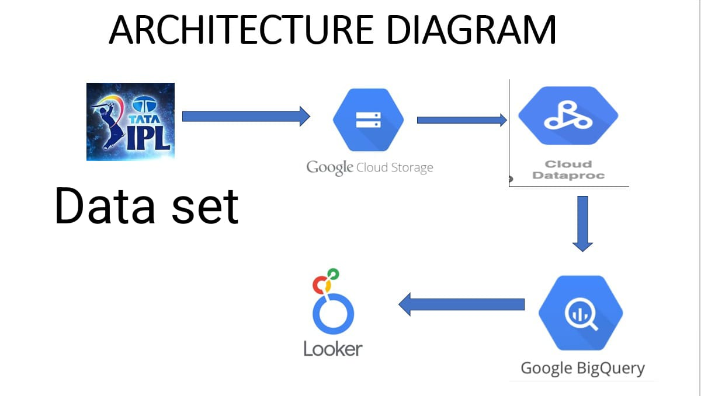

# IPL DATA ANALYTICS | IPL DATA ENGINEERING GCP PROJECT

## INTRODUCTION
This project analyzes an IPL dataset to identify which players lost the most wickets at specific overs during matches. 
It leverages multiple Google Cloud Platform (GCP) services to process and analyze data in a scalable and efficient pipeline. 
LOOKER STUDIO is used to visualize the results for deeper insights.

## ARCHITECTURE

## TECHNOLOGIES USED 
1. PROGRAMMING LANGUAGE - PYTHON
2. SCRIPTING LANGUAGE - SQL
3. GOOGLE CLOUD PLATFORM
    - CLOUD STORAGE
    - BIG QUERY
    - DATA PROC
    - LOOKER STUDIO
## DATASET USED
IPL RECORD DATA 
THIS CONSIST OF ALL THE EVENTS HAPPENED(TOTAL OVERS PLAYED IN THAT SEASON OF IPL,NUMBER OF PLAYERS SCORED CENTURY ,
NUMBER OF PLAYERS TOOK THE MOST WICKET ,NUMBER OF BALLS PLAYED, HIGHEST SCORE SET BY EACH TEAM etc

HERE IS THE DATASET USED FOR THIS PROJECT-[deliveries.csv.zip](https://github.com/THENNAVAN0605/GCP-IPL-ANALYSIS/blob/main/deliveries.csv.zip)

### MORE INFO ABOUT THE DATA SET
ORIGINAL DATA SOURCE - https://www.kaggle.com/datasets/patrickb1912/ipl-complete-dataset-20082020

## SCRIPTS FOR PROJECTS
1. PYTHON CODE [test.py](https://github.com/THENNAVAN0605/GCP-IPL-ANALYSIS/blob/main/test.py)
2. SQL CODE [text.spsql](https://github.com/THENNAVAN0605/GCP-IPL-ANALYSIS/blob/main/text.spsql)
